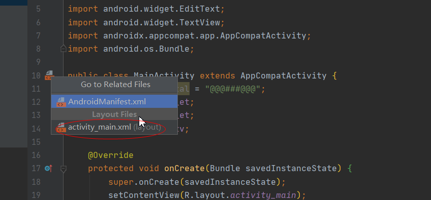
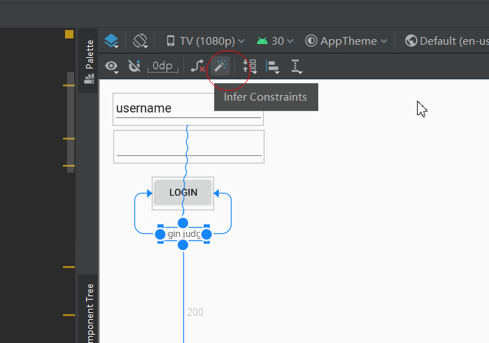
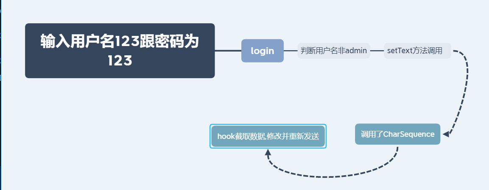

# frida基本使用

1. hook简单的fun函数
2. hook重载函数
3. 导出secret函数使用
4. hook setText的CharSequence序列化方法,同时利用post跟recv截取跟传输数据


首先我配置了下idea,让其能够开发app, 下载sdk等用了1个小时左右. 开了代理,但是老断

同时安装frida环境,这个很简单,自行解决


## hook简单的fun函数

```java
package com.example.app1;

import android.support.v7.app.AppCompatActivity;
import android.os.Bundle;
import android.util.Log;

public class MainActivity extends AppCompatActivity {

    @Override
    protected void onCreate(Bundle savedInstanceState) {
        super.onCreate(savedInstanceState);
        setContentView(R.layout.activity_main);

        while (true){

            try {
                Thread.sleep(1000);
            } catch (InterruptedException e) {
                e.printStackTrace();
            }

            fun(50,30);
        }
    }

    void fun(int x , int y ){
        Log.d("Sum" , String.valueOf(x+y));
    }

}
```


只有一个函数,我们的目的是hook掉fun函数,让其返回我们想要的值

com.example.app1.MainActivity.fun

获取类用

```javascript
var my_class = Java.use("com.example.app1.MainActivity")
```

hook的话,就用

```javascript
my_class.fun.implementation = function(x, y){
    
}
```

这里跟hook一摸一样,传入相同的参数,然后内部实现

```javascript
console.log("Script loaded successfully ");
Java.perform(function x() {
    console.log("Inside java perform function");
    //定位类
    var my_class = Java.use("com.example.app1.MainActivity");
    console.log("Java.Use.Successfully!");//定位类成功！
    //在这里更改类的方法的实现（implementation）
    my_class.fun.implementation = function(x,y){
        //打印替换前的参数
        console.log( "original call: fun("+ x + ", " + y + ")");
        //把参数替换成2和5，依旧调用原函数
        this.fun(2, 5);
    }
});
```

同时我们用python连接frida, 进行通信

```python
import time
import frida


def my_message_handler(message, payload):
        print(message)
        print(payload)
device = frida.get_usb_device()
pid = device.spawn(["com.example.app1"])
device.resume(pid)
time.sleep(1)
session = device.attach(pid)
with open("s1.js") as f:
        script = session.create_script(f.read())

script.on("message", my_message_handler)
script.load()
input()
```

这样就实现简单的fun hook了


## hook重载函数

重载函数由于同名, 所以我们需要指定函数参数类型,这样我们才能hook到重载函数

```java
package com.example.app1;

import android.support.v7.app.AppCompatActivity;
import android.os.Bundle;
import android.util.Log;

public class MainActivity extends AppCompatActivity {

    private String total = "@@@###@@@";

    @Override
    protected void onCreate(Bundle savedInstanceState) {
        super.onCreate(savedInstanceState);
        setContentView(R.layout.activity_main);

        while (true){

            try {
                Thread.sleep(1000);
            } catch (InterruptedException e) {
                e.printStackTrace();
            }

            fun(50,30);
            Log.d("string" , fun("LoWeRcAsE Me!!!!!!!!!"));
        }
    }

    void fun(int x , int y ){
        Log.d("Sum" , String.valueOf(x+y));
    }

    String fun(String x){
        total +=x;
        return x.toLowerCase();
    }

    String secret(){
        return total;
    }
}
```

这里重载函数,参数跟返回值都不一样,我们hook方式一样,只不过需要加多个指定而已

获取类用

```javascript
var my_class = Java.use("com.example.app1.MainActivity")
```

hook的话,就用

```javascript
my_class.fun.overload("int", "int").implementation = function(x, y){
    
}

my_class.fun.overload("java.lang.String").implementation = function(x){
    
}
```

需要注意的是String不是基本类型,要指定java.lang才能获取到,同时,这里有个隐藏函数secret没有调用,我们可以利用choose方法来调用

```javascript
Java.choose("com.example.app1.MainActivity", {
	onMatch : function(instance){
        console.log("Result of secret func: " + instance.secret()+"\n");
    },
    onComplete:function(){}
})
```


## 导出secret函数进行调用

```javascript
console.log("Script loaded successfully");

function callSecretFun(){//define export functon
        Java.perform(function (){//find the secret func
                Java.choose("com.example.app1.MainActivity",{
                        onMatch: function(instance){
                                console.log("Found instance: " + instance);
                                console.log("Result of secret func: " + instance.secret());
                        },
                        onComplete:function(){}
                });
        });
}

rpc.exports = {
        callsecretfunction: callSecretFun //export calSecretFun
};
```

只需要最后写个

```javascript
rpc.exports = {
	callsecretfunction: callSecretFun
}
```

这样就可以导出函数了,然后在python里,直接

```python
script.exports.callsecretfunction()
```

就可以调用了

```python
import time
import frida


def my_message_handler(message, payload):
        print(message)
        print(payload)
device = frida.get_usb_device()
pid = device.spawn(["com.example.app1"])
device.resume(pid)
time.sleep(1)
session = device.attach(pid)
with open("s2.js") as f:
        script = session.create_script(f.read())

script.on("message", my_message_handler)
script.load()
command = ""
while True:
        command = input("Enter command:\n1: Exit\n2:Call secret function\nchoice:")
        if command == "1":
                break
        else:
                script.exports.callsecretfunction()

```

## hook setText的CharSequence序列化

这里难度最大了, 首先我编写app出了很多错, 模拟器里安装,应该选TV模拟,不然位置对不上,同时找不到如何进入layout设置,后面发觉就在这



点击过后,可以手动拖动控件进行布局

同时,在设置每个控件的时候需要点击这个按钮



不然控件全在左上角, 布局的原因,

java代码

```java
public class MainActivity extends AppCompatActivity {
    private String total = "@@@###@@@";
    EditText username_et;
    EditText password_et;
    TextView message_tv;

    @Override
    protected void onCreate(Bundle savedInstanceState) {
        super.onCreate(savedInstanceState);
        setContentView(R.layout.activity_main);

        password_et = (EditText) this.findViewById(R.id.editText1);
        username_et = (EditText) this.findViewById(R.id.editText1);
        message_tv = (TextView) findViewById(R.id.textView);
        this.findViewById(R.id.button).setOnClickListener(new View.OnClickListener() {
            @Override
            public void onClick(View v) {
                if (username_et.getText().toString().compareTo("admin") == 0) {
                    message_tv.setText("You can't login as admin");
                    return;
                }
                //hook taget
                message_tv.setText("Sending to the server :" + Base64.encodeToString((username_et.getText().toString() + ":" + password_et.getText().toString()).getBytes(), Base64.DEFAULT));
            }
        });
    }


}
```

这里这些不是照着打就行,要自己去弄控件后才能获取名称

这里我们要hook的目标就在那里,绕过admin判断, 过程如下



这样就直接设置结果为用户名admin 密码为123了

```javascript
console.log("Script loaded successfully");
Java.perform(function() {
        var tv_class = Java.use("android.widget.TextView");
        var string_class = Java.use("java.lang.String");
        tv_class.setText.overload("java.lang.CharSequence").implementation = function(x){
                var string_to_send = x.toString();
                var string_to_recv;
                send(string_to_send);
                recv(function(received_json_object){
                        string_to_recv = received_json_object.my_data;
                        console.log("string_to_recv: " + string_to_recv);
                }).wait();
                var my_string = string_class.$new(string_to_recv);
                return this.setText(my_string);
        }
});
```

python

```python
import time
import frida
import base64

def my_message_handler(message, payload):
        print(message)
        print(payload)
        if message["type"] == "send":
                print(message["payload"])
                data = message["payload"].split(":")[1].strip()
                print("message:", message)
                data = base64.b64decode(data.encode())
                data = data.decode()
                print(data)
                user, pwd = data.split(":")
                middle = "admin" + ":" + pwd
                middle = middle.encode()
                data = base64.b64encode(middle).decode()
                print("encoded data", data)
                final_result = {"my_data": data}
                print(final_result)
                script.post(final_result)
                print("Modified data send")

device = frida.get_usb_device()
pid = device.spawn(["com.example.app1"])
device.resume(pid)
time.sleep(1)
session = device.attach(pid)
with open("s3.js") as f:
        script = session.create_script(f.read())

script.on("message", my_message_handler)
script.load()
input()
```

这里的通信还是十分有意思的, hook过后,js发消息, 到message里可以接受到, 接受到后, 脚本再次post修改过后的数据给原来的,让其recv, 接受到后,再设置其内容


## 总结

frida-hook十分强大

